# 🏥 Awesome Medical Imaging Archive 🚀

  
  
  
  

## 📌 Top Medical Imaging Archive (PACS Cloud) Platforms & Open-Source Ecosystem
**A Curated List of SaaS Products, Cloud PACS, Vendor Neutral Archives (VNA), DICOM Web Viewers & Healthcare Imaging Repositories**  
*Focused on Enterprise Imaging, Cloud PACS, DICOM Archives, Image Exchange, Diagnostic Viewing & AI Medical Informatics* 🩺⚡

---

## 📊 Market Overview & Industry Structure

> 💡 **Market Size & Fragmentation:** The global **Medical Imaging PACS & Cloud Archive Market** is valued at approximately **USD 3.8 Billion to 4.2 Billion (2025/2026)** and is projected to reach **USD 7.5+ Billion by 2034** with a CAGR of **6.8%–7.5%**. The sector is **moderately fragmented**, led by legacy healthcare conglomerates (GE HealthCare, Philips, Fujifilm, Siemens) alongside specialized enterprise cloud platforms (Visage Imaging, Intelerad/Ambra). The **Cloud PACS** sub-segment is experiencing rapid adoption (>56% of new installations) driven by demand for scalable storage, remote radiology, and zero-footprint web viewers.

---

## 📑 Table of Contents
- [☁️ SaaS & Hosted Commercial Platforms](#-saas--hosted-commercial-platforms)
- [🔓 Open-Source GitHub Projects](#-open-source-github-projects)
- [🤝 How to Contribute](#-how-to-contribute)
- [💖 Support](#-support)
- [📈 Star History](#-star-history)
- [⚠️ Disclaimer](#%EF%B8%8F-disclaimer)

---

## ☁️ SaaS & Hosted Commercial Platforms

Commercial **Cloud PACS**, **Vendor Neutral Archives (VNA)**, and **Medical Image Exchange** SaaS platforms for healthcare enterprises, diagnostic imaging centers, and teleradiology providers.

| 🏢 Platform / SaaS Product | 💰 Starting Price | 🎁 Free Tier / Trial Limit | 📊 Company Size (Revenue / Valuation) | 📝 Overview & Core Features |
| :--- | :--- | :--- | :--- | :--- |
| **[GE Centricity PACS / GE HealthCare Imaging](https://www.gehealthcare.com/)** 🏥 | ~$15,000/yr base tier | ❌ 14-day enterprise demo on request | **$19.6B Revenue** (Public: GEHC) | Industry-standard enterprise PACS and imaging informatics platform supporting diagnostic reading, cardiology, and radiology. |
| **[Philips Vue PACS](https://www.philips.com/)** ⚡ | ~$12,000/yr enterprise | ❌ 14-day clinical workflow demo | **$19.5B Revenue** (Public: PHG) | Enterprise PACS and enterprise imaging solution delivering diagnostic tools and multi-department workflow management. |
| **[Fujifilm Synapse](https://www.fujifilm.com/)** 📸 | ~$10,000/yr facility tier | ❌ 30-day enterprise evaluation | **$20B+ Revenue** (Fujifilm Healthcare) | Comprehensive PACS, VNA, and 3D enterprise imaging platform across radiology, cardiology, and pathology. |
| **[Change Healthcare PACS](https://www.changehealthcare.com/)** 🏢 | ~$8,000/yr starting tier | ❌ Demo on request | **$3.5B+ Revenue** (Part of Optum / UnitedHealth) | Enterprise imaging platform providing cloud archive and radiology PACS workflows across outpatient and hospital networks. |
| **[Merge PACS (Merative)](https://www.merative.com/)** 💻 | ~$6,000/yr base licence | ❌ 14-day guided trial | **$1.0B+ Revenue** (Merative / Francisco Partners) | Enterprise DICOM archive and imaging software for radiology workflows, originally built under IBM Watson Health / Merge. |
| **[Visage Imaging](https://visageimaging.com/)** 🚀 | ~$5,000/mo enterprise base | ❌ 30-day proof-of-concept trial | **$2.5B+ Valuation** (Pro Medicus Ltd: PME) | High-speed server-side rendering enterprise imaging platform enabling ultra-fast cloud diagnostic viewing at scale. |
| **[Ambra Health (Intelerad)](https://ambrahealth.com/)** ☁️ | ~$500/mo per facility | ❌ 14-day customized demo | **$1.7B Valuation** (Acquired for $250M+) | Cloud-native medical image management and exchange platform widely used for sharing studies across institutions. |
| **[Intelerad](https://www.intelerad.com/)** 🌐 | ~$750/mo regional tier | ❌ 14-day clinical trial | **$1.7B Valuation** | Comprehensive medical imaging portfolio (IntelePACS, cloud archives, and vendor-neutral sharing) for radiology. |
| **[MedDream](https://www.softneta.com/)** 🩺 | ~$150/mo per concurrent viewer | ❌ 30-day full feature trial | **~$15M Revenue** (Softneta) | FDA-cleared and CE-certified HTML5 web-based DICOM viewer and PACS component suite for diagnostic reading. |
| **[Life Image](https://www.lifeimage.com/)** 🔗 | ~$400/mo connectivity tier | ❌ 14-day network trial | **~$50M Revenue** (Acquired by Intelerad) | Medical image sharing network connecting providers and patients for seamless inter-hospital study exchange. |

---

## 🔓 Open-Source GitHub Projects

Medical imaging features a mature open-source stack. Developers can pair DICOM server archives (**Orthanc**, **dcm4chee**) with web viewers (**OHIF Viewer**, **CornerstoneJS**) and deep learning frameworks (**MONAI**) to build custom cloud PACS platforms.

| 📦 Project Name | 🌟 GitHub Stars Badge | 📜 License | 🛠️ Primary Tech Stack | 📌 Description & Ecosystem Role |
| :--- | :--- | :--- | :--- | :--- |
| **[Project-MONAI/MONAI](https://github.com/Project-MONAI/MONAI)** 🤖 |  | Apache-2.0 | Python, PyTorch | AI toolkit for healthcare imaging, deep learning segmentation, classification, and research pipelines. |
| **[OHIF Viewer](https://github.com/OHIF/Viewers)** 👁️ |  | MIT | JavaScript, React, DICOMweb | Leading open-source, zero-footprint web DICOM viewer for diagnostic display, integrated with Orthanc and dcm4chee. |
| **[Slicer (3D Slicer)](https://github.com/Slicer/Slicer)** 🔬 |  | BSD-style | C++, Python, Qt | Advanced open-source platform for medical image computing, 3D visualization, rendering, and quantitative research. |
| **[pydicom](https://github.com/pydicom/pydicom)** 🐍 |  | MIT | Python | Pure Python package for reading, inspecting, modifying, and writing DICOM files in data science pipelines. |
| **[CornerstoneJS Core](https://github.com/cornerstonejs/cornerstone)** 📐 |  | MIT | JavaScript | Lightweight HTML5 medical rendering engine powering web-based DICOM image visualization libraries. |
| **[ITK (Insight Toolkit)](https://github.com/InsightSoftwareConsortium/ITK)** 🧮 |  | Apache-2.0 | C++, Python | Cross-platform suite for multidimensional image processing, registration, and medical image segmentation. |
| **[dcm4che Toolkit](https://github.com/dcm4che/dcm4che)** ☕ |  | MPL-1.1 / GPL / LGPL | Java | High-performance open-source collection of healthcare applications and DICOM utilities. |
| **[Weasis](https://github.com/nroduit/Weasis)** 💻 |  | EPL-2.0 | Java | Multipurpose standalone & web DICOM viewer supporting diagnostic clinical workflows, MPR, and 3D rendering. |
| **[Cornerstone3D](https://github.com/cornerstonejs/cornerstone3D)** 🌐 |  | MIT | TypeScript, WebGL | Next-generation 3D viewport rendering library for volumetric DICOM medical image visualization. |
| **[DCMTK](https://github.com/dcmtk/dcmtk)** ⚙️ |  | BSD-style | C, C++ | Open-source DICOM toolkit offering command-line utilities and libraries for parsing and network transfer. |
| **[pynetdicom](https://github.com/pydicom/pynetdicom)** 📡 |  | MIT | Python | Pure Python implementation of the DICOM network protocol (C-STORE, C-FIND, C-GET, C-MOVE). |
| **[dcm4chee-arc-light](https://github.com/dcm4che/dcm4chee-arc-light)** 🏛️ |  | AGPL-3.0 | Java, DICOMweb, HL7 | Enterprise-grade DICOM archive (PACS), VNA, and DICOMweb endpoint container for large hospital networks. |
| **[Cornerstone WADO Image Loader](https://github.com/chafey/cornerstoneWADOImageLoader)** 📥 |  | MIT | JavaScript | DICOM WADO-URI and WADO-RS image loader for CornerstoneJS viewers. |
| **[Orthanc Setup Samples](https://github.com/orthanc-server/orthanc-setup-samples)** 🐳 |  | GPL-3.0 | Docker, Shell | Production Docker-Compose configurations for deploying Orthanc PACS with PostgreSQL, OHIF, and Keycloak. |
| **[dicom-numpy](https://github.com/innolitics/dicom-numpy)** 🔢 |  | MIT | Python, NumPy | Python utility for extracting 3D NumPy arrays from series of DICOM files. |

---

## 🤝 How to Contribute

Contributions are warmly welcomed! Help keep this medical imaging archive accurate and comprehensive. 💖

1. **Fork** the repository 🍴
2. **Create a new branch** (`git checkout -b feature/add-new-pacs`) 🌿
3. **Add or update entries** in `README.md` following the tabular format 📝
4. **Submit a Pull Request** with a brief summary of additions 🚀

Please ensure descriptions remain objective, factual, and backed by verifiable source links.

---

## 💖 Support

If you find this repository helpful for your healthcare IT, radiology research, or engineering projects, please consider supporting the maintenance of this repository! ⭐

- ⭐ **Star this repository** to boost visibility for developers and radiology IT professionals.
- 🔄 **Share with colleagues** in imaging informatics, medical AI, and health tech.
- ☕ **Buy me a coffee / Sponsor on GitHub:**  
  

Your support encourages continuous updates and inclusion of new medical imaging tools! Thank you! ❤️

---

## 📈 Star History

---

## ⚠️ Disclaimer

- This list is **community-curated** for educational, architectural, and informational research purposes only.
- Medical imaging archives and PACS manage **Protected Health Information (PHI)** and are subject to stringent regulations including **HIPAA**, **GDPR**, and **FDA medical device regulations**.
- Deploying open-source software (such as Orthanc or dcm4chee) in clinical environments requires robust access control, audit logging, data encryption, and clinical validation. This repository does not constitute medical, legal, or regulatory advice.
